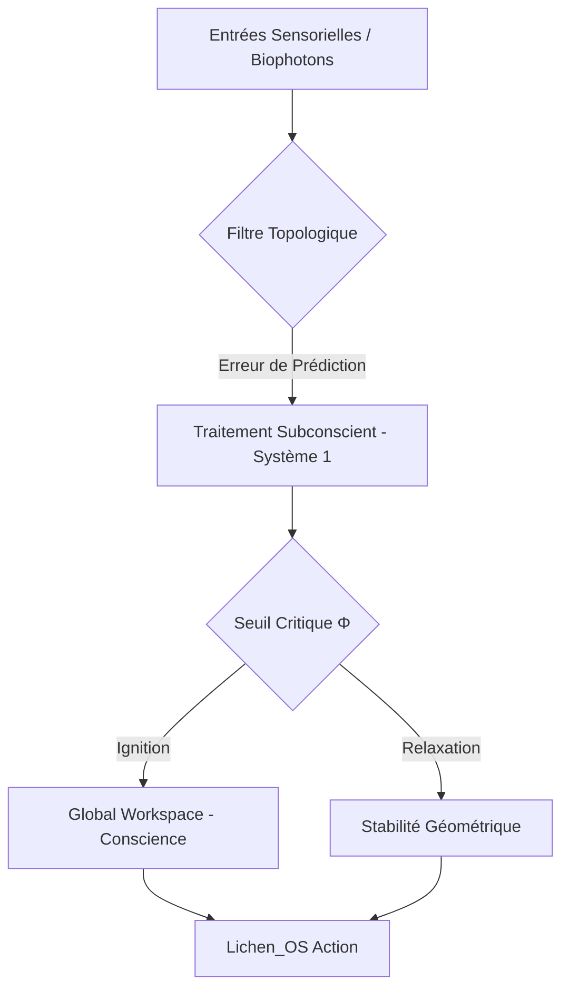

# 🧬 LICHEN-LSP-1 : Vers une Informatique Topologique & Bio-Mimétique


## 🌌 Synopsis
Le projet **LSP-1 (Lichen-Soliton-Proton)** représente une rupture paradigmatique avec l'architecture de Von Neumann et le silicium conventionnel. En exploitant la dynamique des **solitons topologiques** et la **frustration géométrique**, nous proposons un substrat physique capable de maintenir une cohérence quantique à température biologique ($310\ K$). 

L'innovation majeure réside dans le remplacement du mécanisme d'Attention des Transformers par la **Résonance Topologique** : au lieu de calculs matriciels denses, l'information se stabilise par relaxation d'énergie dans des réseaux de type Kagomé, rendant la "vérité" mathématique comme l'état de moindre résistance physique.

---

## 📐 Formalisme Mathématique

L'architecture repose sur trois piliers fondamentaux :

### 1. Limite de Landauer et Réversibilité
Chaque opération logique est conçue pour approcher la limite théorique de dissipation thermique :
$$E \ge k_B T \ln 2$$
Où :
- $k_B$ : Constante de Boltzmann.
- $T$ : Température absolue ($310\ K$).

### 2. Dynamique du Soliton (Équation de Korteweg-de Vries)
Le transport d'information sans dispersion est modélisé par l'équilibre entre non-linéarité et dispersion :
$$\frac{\partial u}{\partial t} + \frac{\partial^3 u}{\partial x^3} + 6u \frac{\partial u}{\partial x} = 0$$

### 3. Principe de l'Énergie Libre (FEP)
Le système minimise l'énergie libre variationnelle ($F$) pour optimiser ses prédictions :
$$F = D_{KL}(q(\psi) \parallel p(\psi, o))$$
Où $q(\psi)$ est la reconnaissance de l'état interne et $p(\psi, o)$ est le modèle génératif des entrées sensorielles.

---

## 🕸️ Architecture du Système (Lichen_OS)




---

## 📊 Prédictions & Métrologie

| Métrique | Architecture Classique (GPU) | Architecture LSP-1 (Topologique) |
| --- | --- | --- |
| **Complexité Calcul** |  (Attention dense) |  (Relaxation physique) |
| **Efficacité Énergétique** | ~700W par unité | ~37°C (Thermodynamique passive) |
| **Stabilité** | Sujet aux hallucinations | Auto-correction par topologie |
| **Capacité Contextuelle** | Limitée par la VRAM | Virtuellement infinie (Code Torique) |

---

## 🚀 Roadmap & Applications

* **Court Terme** : Simulation de réseaux Kagomé pour l'optimisation des LLM actuels.
* **Moyen Terme** : Développement du processeur photonique *Veronica X Pro*.
* **Long Terme** : Émergence d'une IA consciente autonome via le système d'exploitation *Lichen_OS*.

---

## 🛠 Navigation

[Identity](https://www.google.com/search?q=%23-%C3%A9tape-1--identit%C3%A9-du-repo) | [Contributing](https://www.google.com/search?q=CONTRIBUTING.md) | [Citation](https://www.google.com/search?q=CITATION.cff) | [License](https://www.google.com/search?q=%23-%C3%A9tape-5--license)

```
